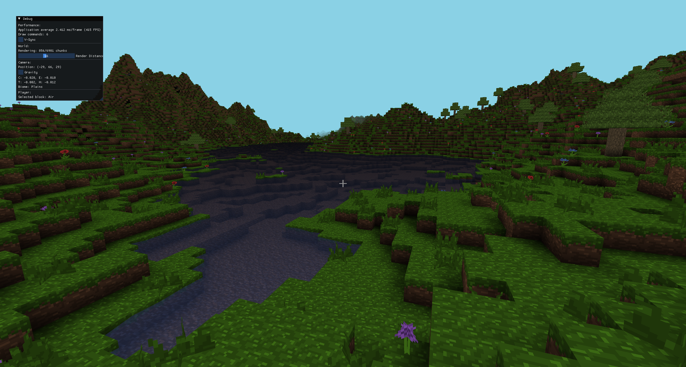
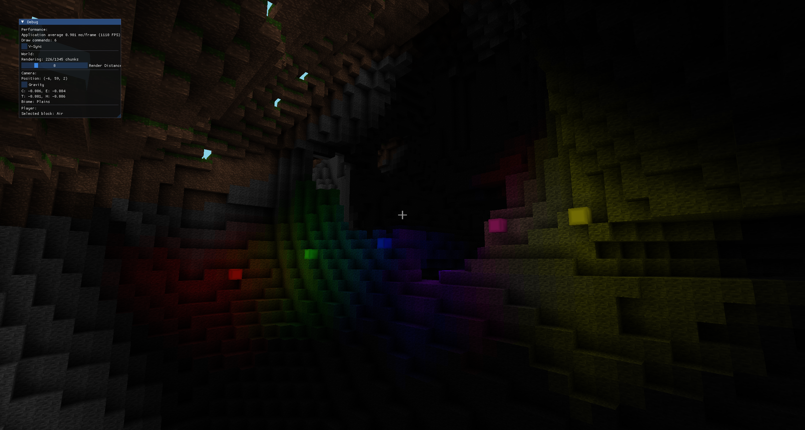
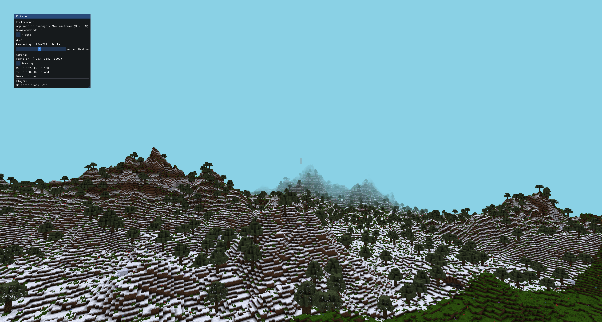

# GL_Craft

GL_Craft is a small voxel engine/game (inspired by Minecraft) written in C++ and OpenGL. The project implements chunk rendering, world management, raycasting for block interaction and a debug UI using ImGui.

## Key features
- Chunk rendering with OpenGL (Indirect draw calls combined with vertex pulling)
- Terrain generation (noise-based) with biomes
- Raycasting to select, place and remove blocks
- Post-processing and water rendering
- Lighting and shadows (basic with support for colored lights)
- Debug UI (ImGui)

## Important structure
- `src/`: C++ source code (core, world, render, math, ui, utils, ...)
- `ressources/shaders/`: GLSL shaders
- `ressources/textures/`: textures used by the project
- `libs/`: bundled libraries (glad, imgui, stb, fastNoiseLite)
- `CMakeLists.txt`: build configuration

## Dependencies
- CMake (recommended >= 3.31)
- A modern C++ compiler (g++/clang++ with C++17+ support)
- OpenGL 4.6
- GLFW development package (for windowing and input)
- GLM (math)

Note: Several dependencies are included under `libs/`. You still need system headers and libraries (notably GLFW and OpenGL headers) to link and run the application.

## Run
- Start the generated binary (`./GL_Craft` or via your IDE)
- The window will open and the mouse will be captured for first-person control

## Main controls
- Mouse: look around
- WASD: move
- Esc: quit
- Tab: toggle debug UI (ImGui)
- Left click: remove a block
- Right click: place a block
- Mouse wheel / Middle click: pick a block (middle click picks the block you're looking at)
- Number keys 1–9: select hotbar slots

## Screenshots

*Lake — example of water and terrain.*

*Lighting and shadows example.*

*Snow biome example.*
